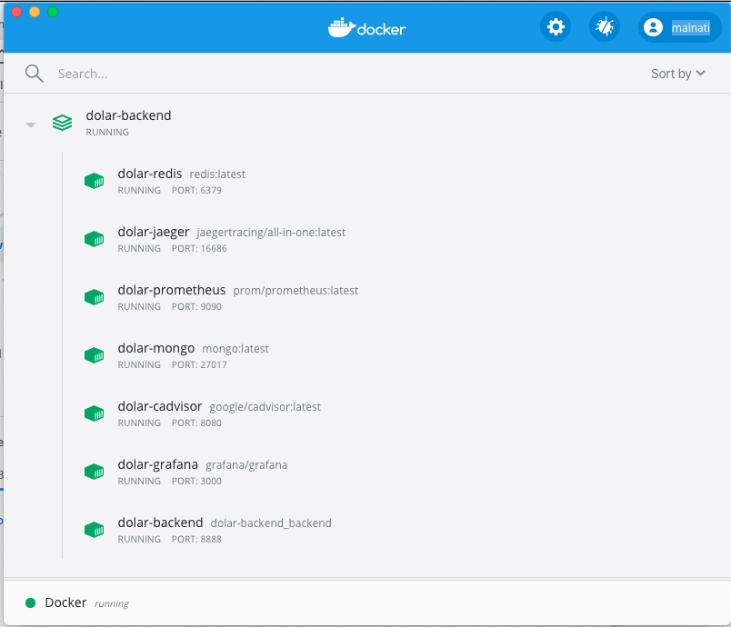
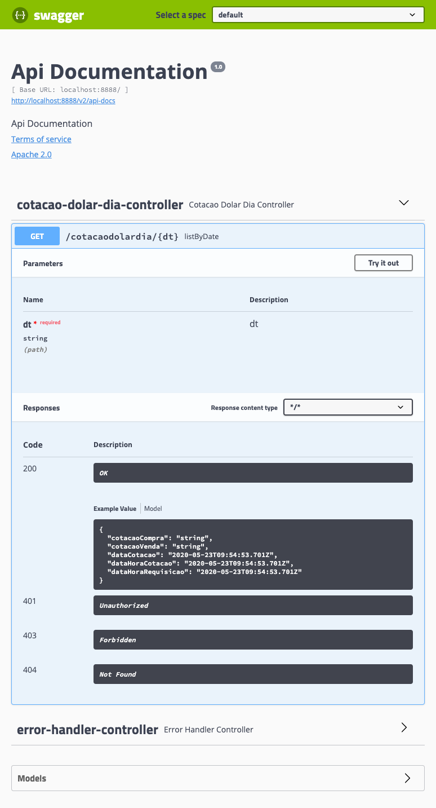
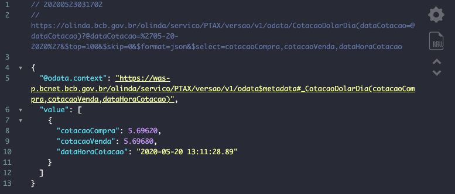
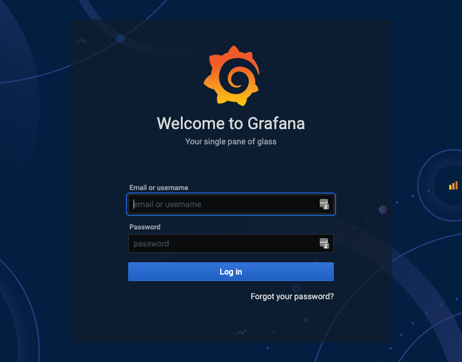
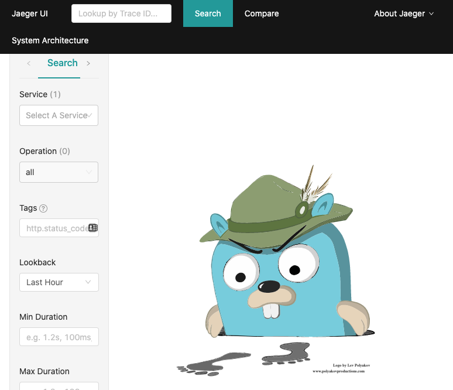
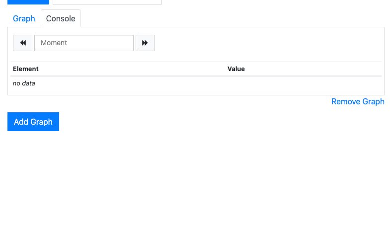
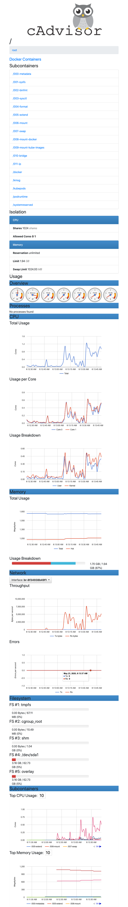

[![maven-img]][maven]]

# dolar-backend

**Desafio**: Construir um backend em 24h.

# Links

### API de Origem

Verifique as informações obtidas através do back end e compare o resultado consultando o [Bacen](<https://olinda.bcb.gov.br/olinda/servico/PTAX/versao/v1/odata/CotacaoDolarDia(dataCotacao=@dataCotacao)?@dataCotacao=%2705-20-2020%27&$top=100&$skip=0&$format=json&$select=cotacaoCompra,cotacaoVenda,dataHoraCotacao>) ou então você pode usar o [Swagger do Bacen](https://olinda.bcb.gov.br/olinda/servico/PTAX/versao/v1/swagger-ui3#/)

### Local

Ao executar o backend em ambiente local, utilize os links abaixo para testar a API.

- Swagger [http://localhost:9999/swagger-ui.html](http://localhost:9999/swagger-ui.html)
- API [http://localhost:9999/cotacaodolardia/20052020](http://localhost:9999/cotacaodolardia/20052020)

### No Docker Container

Ao executar o backend no Docker Container, utilize os links abaixo para testar a API.

- Swagger [http://localhost:8888/swagger-ui.html](http://localhost:9999/swagger-ui.html)
- API [http://localhost:8888/cotacaodolardia/20052020](http://localhost:9999/cotacaodolardia/20052020)
- Grafana [http://localhost:3000/login](http://localhost:3000/login)
- Jaeger [http://localhost:16686/search](http://localhost:16686/search)
- cAdvisor [http://localhost:8080/containers/](http://localhost:8080/containers/)
- Prometheus [http://localhost:9090/graph](http://localhost:9090/graph)

### O Swagger deve ser exibido assim

### O Json do Bacen deve ser parecido com este

## O Grafana deve ser exibido conforme a imagem abaixo

## A tela de monitoramento do Jaeger é assim

## O Prometheus é assim

## O cAdvisor é assim

# Intalação

`$>docker-compose -f docker-compose.yml up -d`

# Makefile

Use o Makefile para facilitar o desenvolvimento

`$> make <comando>`

### Variáveis do Makefile

- JAR_NAME = backend-0.0.1-SNAPSHOT.jar
- APP_BACKEND_PATH = backend
- APP_IMAGE_NAME = dolar-backend_backend
- APP_CONTAINER_NAME = dolar-backend
- DOCKER_COMPOSE_FILE = docker-compose.yml

### Comandos do Makefile

| Comandos seguidos do make | Descrição                                                                                                                                                                |
| ------------------------- | ------------------------------------------------------------------------------------------------------------------------------------------------------------------------ |
| `make prune`              | docker system prune -a --volumes **TAKE CARE WITH PRUNE!**                                                                                                               |
| `make ps`                 | docker ps --all                                                                                                                                                          |
| `make stats`              | docker container stats \$(docker container ps --format={{.Names}}) **To list all running containers with CPU, Memory, Networking I/O and Block I/O stats.**              |
| `make network`            | docker network ls                                                                                                                                                        |
| `make volumes`            | mkdir -p ~/volumes/\$(APP_CONTAINER_NAME)/www/html/                                                                                                                      |
| `make stash`              | git stash save "Changes saved by Makefile."                                                                                                                              |
| `make install`            | mvn -P local -f \$(APP_BACKEND_PATH)/pom.xml clean install                                                                                                               |
| `make sonar`              | mvn -f \$(APP_BACKEND_PATH)/pom.xml initialize sonar:sonar                                                                                                               |
| `make local`              | mvn spring-boot:run -P local -f \$(APP_BACKEND_PATH)/pom.xml                                                                                                             |
| `make clean`              | rm -f $(APP_BACKEND_PATH)/target/$(JAR_NAME) && mvn -P local -f \$(APP_BACKEND_PATH)/pom.xml clean                                                                       |
| `make bash`               | docker run -it \$(APP_CONTAINER_NAME) /bin/bash                                                                                                                          |
| `make up`                 | docker-compose -f \$(DOCKER_COMPOSE_FILE) up -d                                                                                                                          |
| `make down`               | docker-compose -f \$(DOCKER_COMPOSE_FILE) down                                                                                                                           |
| `make start`              | docker-compose -f \$(DOCKER_COMPOSE_FILE) start                                                                                                                          |
| `make remove`             | docker-compose -f \$(DOCKER_COMPOSE_FILE) start                                                                                                                          |
| `make stop`               | docker-compose -f \$(DOCKER_COMPOSE_FILE) stop                                                                                                                           |
| `make build`              | docker build -t $(APP_IMAGE_NAME) --no-cache --force-rm --build-arg JAR_FILE=$(APP_BACKEND_PATH)/target/$(JAR_NAME) -f $(APP_BACKEND_PATH)/src/main/docker/Dockerfile ./ |
| `make logs`               | docker logs \$(APP_CONTAINER_NAME)\_1 -f --tail=200                                                                                                                      |
| `make recreate`           | make down && make prune && make up && make logs                                                                                                                          |
| `make deploy`             | docker cp $(APP_BACKEND_PATH)/target/$(JAR_NAME) $(APP_CONTAINER_NAME):/$(JAR_NAME)                                                                                      |
| `make image`              | docker cp $(APP_BACKEND_PATH)/target/$(JAR_NAME) $(APP_CONTAINER_NAME):/$(JAR_NAME)                                                                                      |

# Pendências

- Monitoração com Prometheus e Grafana exibindo métricas da API, do DB e da infra
- Tracing (Jaeger)
- Testes automatizados efetivos
- Atividade de Especificação
